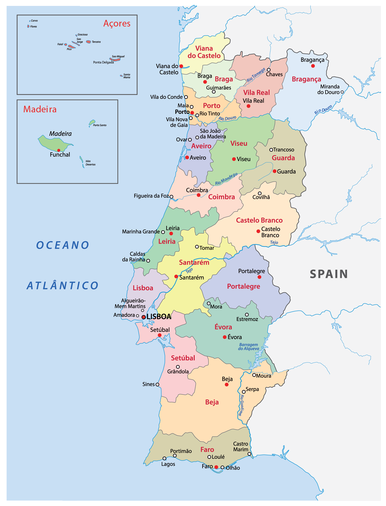

# Bank Marketing Data

[Link to the data: ](https://archive.ics.uci.edu/dataset/222/bank+marketing)

## Overview 
The Bank Marketing dataset, sourced from a Portuguese bank, contains information on a direct marketing campaign that aimed to convince clients to subscribe to a term deposit. It includes data on client demographics (e.g., age, job, marital status), details of the campaign (e.g., contact frequency, last contact day), and economic context (e.g., employment variation rate, consumer price index). The target variable indicates whether a client subscribed to the term deposit. This dataset, with around 45,000 entries, poses challenges due to its imbalanced nature, as most clients did not subscribe, making it useful for classification models that handle imbalanced data.

### Features 

1. **age**: Age of the client (numeric).
2. **job**: Type of job (categorical, e.g., "admin", "technician", "entrepreneur").
3. **marital**: Marital status (categorical, e.g., "married", "single", "divorced").
4. **education**: Education level (categorical, e.g., "primary", "secondary", "tertiary", "unknown").
* **default**: Has credit in default? (categorical, "yes" or "no").
* **balance**: Average yearly balance, in euros (numeric).
* **housing**: Has housing loan? (categorical, "yes" or "no").
* **loan**: Has personal loan? (categorical, "yes" or "no").

### Related to the Last Contact of the Current Campaign

9. **contact**: Contact communication type (categorical, e.g., "cellular", "telephone").
10. **day**: Last contact day of the month (numeric, 1–31).
11. **month**: Last contact month of year (categorical, e.g., "jan", "feb", "mar").

### Campaign-related Information

12. **duration**: Last contact duration, in seconds (numeric). *Note*: Can be predictive if the duration is zero.
13. **campaign**: Number of contacts performed during this campaign for this client (numeric).
14. **pdays**: Days since the client was last contacted (numeric; -1 means client was not previously contacted).
15. **previous**: Number of contacts before this campaign (numeric).
16. **poutcome**: Outcome of the previous marketing campaign (categorical, e.g., "success", "failure", "unknown").

### Economic Indicators

17. **emp.var.rate**: Employment variation rate — quarterly indicator (numeric).
18. **cons.price.idx**: Consumer price index — monthly indicator (numeric).
19. **cons.conf.idx**: Consumer confidence index — monthly indicator (numeric).
20. **euribor3m**: Euribor 3 month rate — daily indicator (numeric).
21. **nr.employed**: Number of employees — quarterly indicator (numeric).

### Target Variable

22. **y**: Has the client subscribed to a term deposit? (binary: "yes" or "no").

| Feature             | Variable Type     | Python Type  | Range of Possible Values                                        |
|---------------------|-------------------|--------------|-----------------------------------------------------------------|
| age                 | Continuous        | int          | 18 to 95 (typical range, as it's client age)                    |
| job                 | Categorical       | str          | 'admin', 'technician', 'entrepreneur', etc.                     |
| marital             | Categorical       | str          | 'married', 'single', 'divorced'                                 |
| education           | Categorical       | str          | 'primary', 'secondary', 'tertiary', 'unknown'                   |
| default             | Binary            | str          | 'yes', 'no'                                                     |
| balance             | Continuous        | float        | -8019.0 to 102127.0 (average yearly balance in euros)           |
| housing             | Binary            | str          | 'yes', 'no'                                                     |
| loan                | Binary            | str          | 'yes', 'no'                                                     |
| contact             | Categorical       | str          | 'cellular', 'telephone'                                         |
| day                 | Discrete          | int          | 1 to 31 (day of the month)                                      |
| month               | Categorical       | str          | 'jan', 'feb', 'mar', ..., 'dec'                                 |
| duration            | Continuous        | int          | 0 to 4918 (contact duration in seconds)                         |
| campaign            | Discrete          | int          | 1 to 63 (number of contacts for this client in this campaign)   |
| pdays               | Discrete          | int          | -1 to 999 (days since client was last contacted; -1 if never)   |
| previous            | Discrete          | int          | 0 to 7 (number of contacts before this campaign)                |
| poutcome            | Categorical       | str          | 'success', 'failure', 'unknown'                                 |
| emp.var.rate        | Continuous        | float        | -3.4 to 1.4 (employment variation rate, quarterly)              |
| cons.price.idx      | Continuous        | float        | 92.201 to 94.767 (consumer price index)                         |
| cons.conf.idx       | Continuous        | float        | -50.8 to -26.9 (consumer confidence index)                      |
| euribor3m           | Continuous        | float        | 0.635 to 5.045 (Euribor 3-month interest rate)                  |
| nr.employed         | Continuous        | float        | 4963.6 to 5228.1 (number of employees, quarterly)               |
| y                   | Binary            | str          | 'yes', 'no' (target variable indicating term deposit)           |
