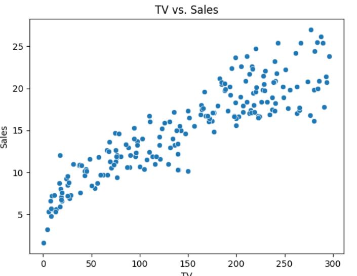

# Testing Assumptions in Linear Regression 

When using **linear regression** for predictive modeling, it's critical to validate that certain *assumptions* hold. This helps ensure *reliable* and *interpretable* results.

## Key Assumptions

Linear regression assumes:
1. [**Linearity**](#linearity): The relationship between predictors and the outcome is linear.
2. [**Independence**](#independence): Observations are independent of each other.
3. [**Homoscedasticity**](#homoscedasticity): Constant variance of errors.
4. [**Normality**](#normality): Errors are normally distributed.
5. [**No Multicollinearity**](#multicollinearity): Predictors are not highly correlated with each other.

Each of these assumptions should be tested before relying on the model.

<a name="linearity"></a>
### Testing Linearity

To test for linearity:
- **Scatterplots** of each predictor against the outcome variable
- **Residual vs. Fitted Plot**: Residuals should show no clear pattern.

<a name="independence"></a>
### Testing Independence

To verify independence:
1. **Durbin-Watson Test**: Tests for autocorrelation.
2. **Residuals vs. Time Plot**: Useful for time series data to check for patterns.

<a name="homoscedasticity"></a>
### Checking Homoscedasticity

**Homoscedasticity** implies that residuals have constant variance across all levels of the predictor variables. Use:
- Residuals vs. Fitted plot to visually inspect variance.
- **Breusch-Pagan Test** to statistically check for heteroscedasticity.

<a name="normality"></a>
### Testing Normality

Normality can be assessed by examining the **distribution of residuals**:
- **Histogram** or **QQ Plot** to check for approximate normal distribution.
- **Shapiro-Wilk Test** as a statistical test for normality.

<a name="multicollinearity"></a>
### Multicollinearity

To test for multicollinearity:
- Calculate the **Variance Inflation Factor (VIF)** for each predictor.
- A high VIF (generally > 10) indicates potential multicollinearity problems.


## Code Example in Python 

To generate a linear regression model in Python using the `statsmodels` library, use the following code:

```python
import statsmodels.api as sm

# Assuming X is the predictor and y is the response variable
X = sm.add_constant(X)  # Adds a constant term to the predictor
model = sm.OLS(y, X).fit()  # Fit the model
print(model.summary())  # Output the summary of the model

```

## Summary

Testing and validating assumptions in **linear regression** is essential for building accurate models. Failing to validate these assumptions can lead to unreliable results.



> "Assumptions are the foundation of reliable models. Verify them to ensure accurate predictions and interpretations."


## Further Reading

For more details on linear regression assumptions, visit:
- [Introduction to Linear Regression](https://en.wikipedia.org/wiki/Linear_regression)
